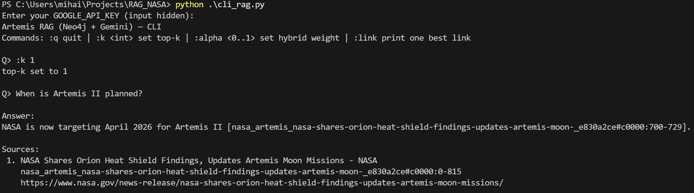

# NASA Artemis RAG — What it is
 A compact end-to-end Retrieval-Augmented Generation system over recent NASA Artemis
 press releases/blog posts that answers questions with exact chunk-level citations.

## Motivation
 While reading Artemis updates, I couldn’t relocate the exact line that stated
 NASA is targeting April 2026 for Artemis II (and mid-2027 for Artemis III) with
 related heat-shield findings. The web search surfaced many pages but not the precise sentence.
 I wanted a tool that lets me ask a question and jump straight to the exact place
 in the official article I remember. This RAG ingests and chunks Artemis posts,
 so answers include precise [chunk_id:start-end] citations that pinpoint the source text, for example, [doc_id#c0004:120-240] that point to the precise NASA text.

## Tech Stack

- **Python** orchestration  
- **Scraping**: httpx, BeautifulSoup, trafilatura  
- **Chunking**: LangChain `RecursiveCharacterTextSplitter`  
- **Embeddings/LLM**: Google Gemini (`text-embedding-004`, `gemini-2.5-flash`)  
- **Database**: Neo4j 5.x with vector + full-text indexes  
- **Interface**: CLI (extendable to web)

## How It Works

1. **Ingest** (`parsing_artemis.py`) -> Crawl NASA Artemis -> JSONL docs  
2. **Prepare** (`data_preparation.py`) -> Split to chunks, embed, upsert into Neo4j  
3. **Index** (`neo4j_schema_bootstrap.py`) -> Constraints + vector/full-text indexes  
4. **Retrieve** (`cli_rag.py`) -> Hybrid semantic + keyword search, dedupe per doc  
5. **Generate Answer** -> Gemini produces grounded answers with `[chunk_id:start-end]` citations

## How to run it

1. **Start DB**

```powershell
docker compose up -d
``` 

Neo4j will be at bolt://127.0.0.1:7687 (user neo4j / password).

2. **Init schema**
```
python neo4j_schema_bootstrap.py
python ping_neo4j.py    # should print 1
```
3. **Ingest Artemis data**
```
python parsing_artemis.py
python data_preparation.py
```
4. **Run RAG CLI**
```
python cli_rag.py
```
## Example of use

